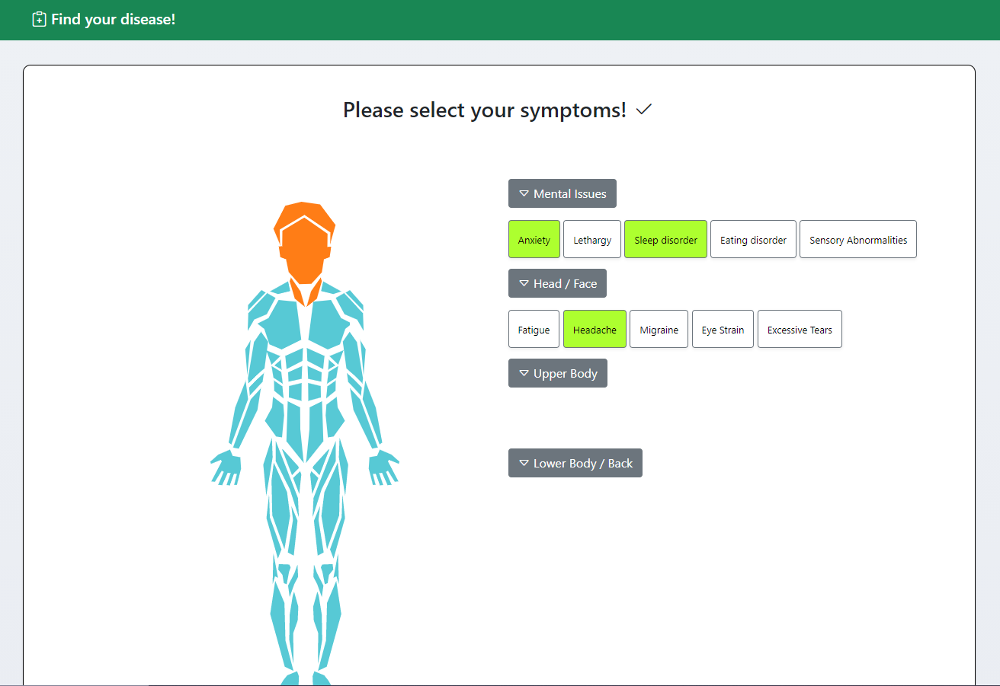

# TeamProject_Group15

## Find your disease website

This website helps a user determine the disease or condition they might have based on the symptoms they have. 

## How to use

1. After dividing the human body into several parts, it shows the symptoms of each 
part. 
2. Users click on the existing options that corresponds to their symptoms. 
3. When symptom selections are completed, then the application will derive certain disease that 
match with the symptoms. 
4. The application provides a simple solution related to the disease and provides detailed 
documentation(URL) related to the disease. 
5. Users who want to know more about the disease can click on the URL or click on the disease 
that the application displaying.
6. The website also has a feature that allows a user to search for hostpitals and displays the location on a map.

##  Screenshot

## Short demo video

Please click this link to see the demo of the website: https://youtu.be/4VCVdKlbDDM

## Types of diseases(Symptoms, URL)

- **Hypertension:** Stiff Neck, Headache, Migraine, Fatigue, Shoulder Discomfort
  https://en.wikipedia.org/wiki/Hypertension

- **Turtle neck syndrome:** Stiff Neck, Fatigue, Shoulder Discomfort, Headache
  https://sebarun.com/en/info/page41.php

- **Herniation of intervertebral disk:** Low Back Pain, Leg Numbness, Buttocks Pain
  https://www.mayoclinic.org/diseases-conditions/herniated-disk/symptoms-causes/syc-20354095

- **Dry eye syndrome:** Eye strain, Excessive tears
  https://en.wikipedia.org/wiki/Dry_eye_syndrome

- **Carpal tunnel syndrome:** Finger Numbness, Sensory Abnormalities, Wrist Pain
  https://en.wikipedia.org/wiki/Carpal_tunnel_syndrome

- **Chronic Fatigue Syndrome:** Muscle Pain, Fatigue, Sleep disorder, Eating disorder
  https://en.wikipedia.org/wiki/Chronic_fatigue_syndrome

- **Insomnia:** Fatigue, Anxiety, Sleep disorder, Eating disorder
  https://en.wikipedia.org/wiki/Insomnia

- **Depressive disorder:** Lethargy, Fatigue, Sleep disorder, Eating disorder
  https://en.wikipedia.org/wiki/Mood_disorder#Depressive_disorders

- **Fatigue:** Fatigue, Lethargy
  https://en.wikipedia.org/wiki/Fatigue

- **Spondylopathy:** Walking Abnormalities, Leg Numbness
  https://en.wikipedia.org/wiki/Spondylopathy

- **Eating disorder:** Eating disorder
  https://en.wikipedia.org/wiki/Eating_disorder

- **Shoulder disorder:** Shoulder Discomfort
  https://en.wikipedia.org/wiki/Shoulder_problem

- **Eye strain:** Eye Strain
  https://en.wikipedia.org/wiki/Eye_strain

- **Myalgia:** Muscle Pain
  https://en.wikipedia.org/wiki/Myalgia

- **Low Back Pain:** Low Back Pain
  https://en.wikipedia.org/wiki/Low_back_pain

- **Wrist Pain:** Wrist Pain
  https://en.wikipedia.org/wiki/Wrist_pain
